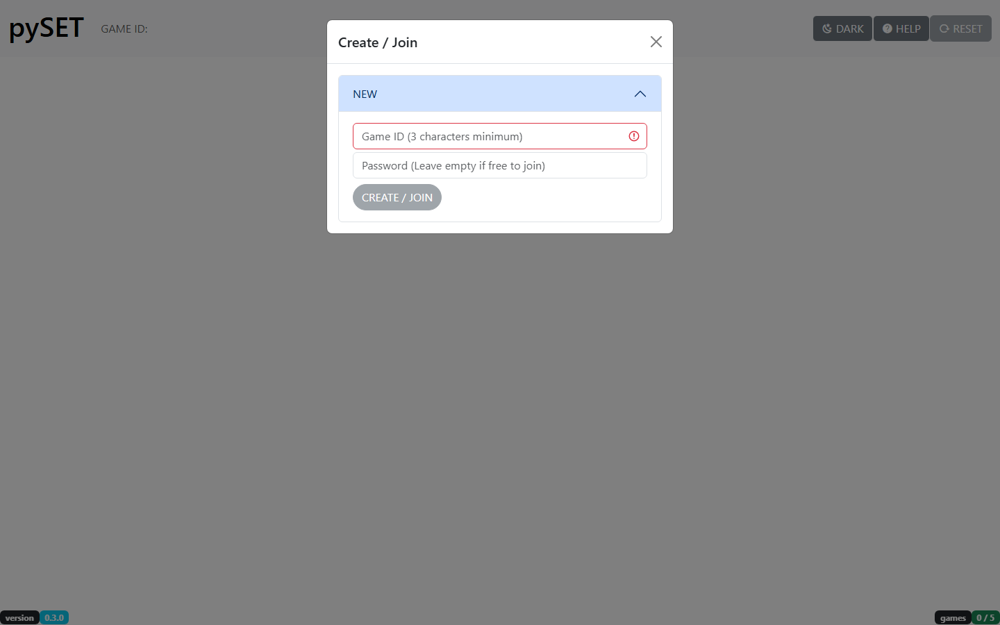
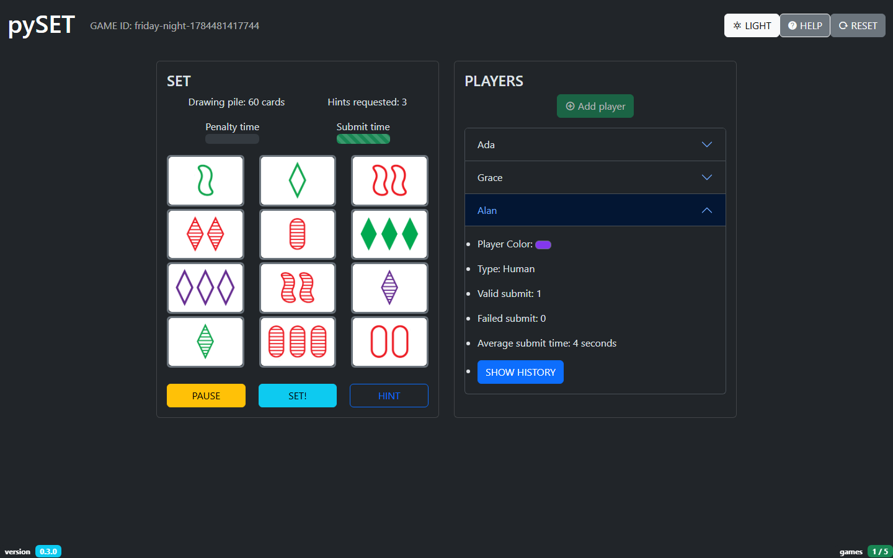
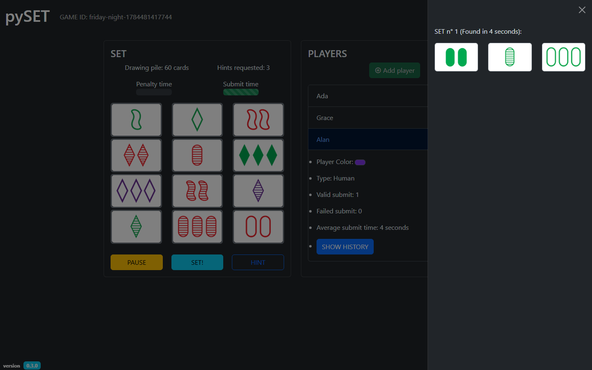
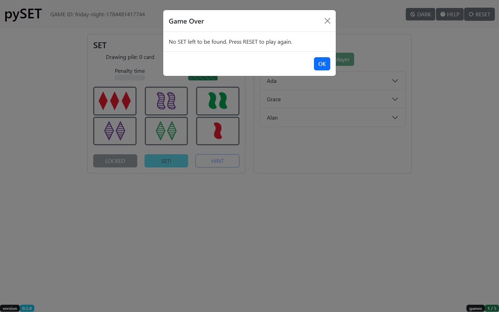

# SET

Fun project where I could cram in some of the knowledge I gained from coding in VUE-2 and VUE-3 (With NUXT) and Python-3.

Feel free to check the [game rules](https://en.wikipedia.org/wiki/Set_(card_game)#Games) before playing... In its current state, the game is meant to be played on a **SINGLE SHARED SCREEN**.

You will need to know (among other few things) how to use the terminal command prompt in order to build + install + run this game on your own computer. If not, you can directly skip to [this section](#tldr).

## SCREENSHOTS

Create a game (optionally password-protected), or join one already in progress:

Find a SET among the cards on the grid while everyone's stats (color, valid/failed submits,
average time) update live -- stuck? Ask for a hint. Light or dark, whichever you prefer:

Check "SHOW HISTORY" on any player to replay every SET they've found so far:

Once neither the grid nor the draw pile has a SET left to find, the game calls it:

## VERSION

The current version lives in [pyproject.toml](pyproject.toml) and is read from package
metadata at runtime. See [CHANGELOG.md](CHANGELOG.md) for the full version history.

## TABLE OF CONTENT

<!-- TOC -->

- [SET](#set)
  - [SCREENSHOTS](#screenshots)
  - [VERSION](#version)
  - [TABLE OF CONTENT](#table-of-content)
  - [TL;DR](#tldr)
  - [INSTALLATION](#installation)
  - [POSSIBLE FUTURE UPDATES](#possible-future-updates)

<!-- /TOC -->

## TL;DR

"I don't want to install anything or read anything, just make it quick and easy please." I hear you say? Sure, just click [here](https://pyset.onrender.com/) and have fun. 

## INSTALLATION

Want to build the frontend, install the Python backend, or run everything through Docker/Rancher
instead? The full guide (including Debian/Ubuntu, Arch Linux and Windows instructions) lives in
[INSTALL.md](INSTALL.md).

## POSSIBLE FUTURE UPDATES

- "AI" player(s)
- Handle multiple clients (different screens)